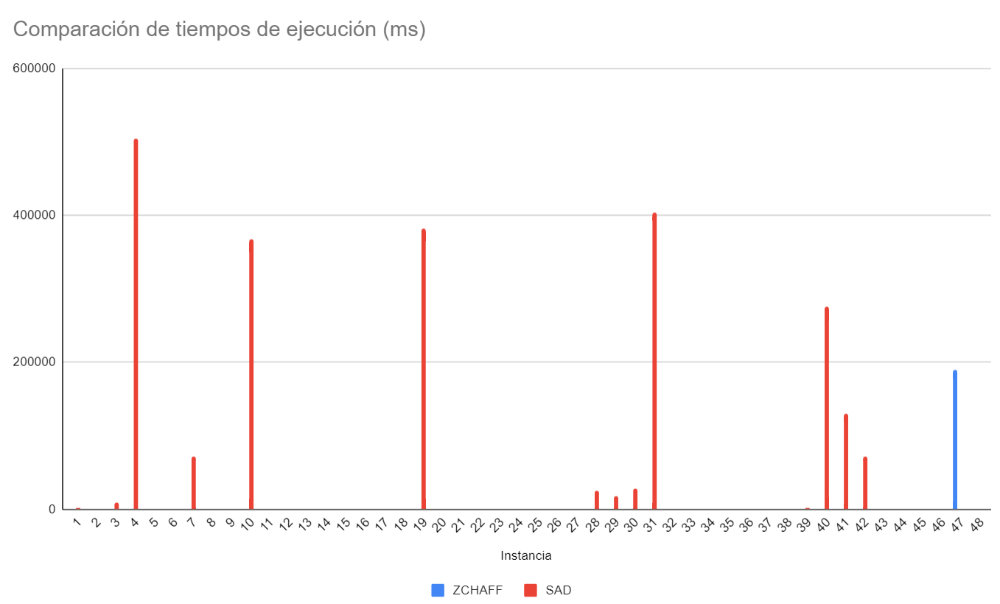

# Informe

# SatSudoku

Para este proyecto, se plantea resolver un problema de *Sudoku* convirtiéndolo primero en una expresión booleana CNF, y usando un resolvedor de SAT para conseguir una asignación de valores que satisfaga la expresión, se genera la solución del Sudoku.

# **Manual de uso**

Para buildear el proyecto simplemente hay que hacer `make` en la raiz del mismo.

- Para ejecutar el conversor de ************************************Sudoku a SAT************************************ aislado:
    
    ```bash
    ./SatSolver --toSat < $SUDOKU_FILE
    ```
    
    En donde `$SUDOKU_FILE` es un archivo con una instancia en el formato de sudoku adecuado
    

- Para ejecutar el ***solver*** aislado:
    
    ```bash
    ./SatSolver --solve < $SAT_FILE
    ```
    
    En donde `$SAT_FILE` es un archivo con una instancia de SAT en el formato de entrada de SAT adecuado
    

- Para ejecutar el conversor de SAT a Sudoku:
    
    ```bash
    ./SatSolver --toSudoku < $SAT_SOLUTION_FILE
    ```
    
    En donde `$SAT_SOLUTION_FILE` es un archivo con una instancia de solución en el formato de salida SAT adecuado.
    
    > El conversor de SAT a sudoku si bien reconoce el formato de entrada descrito en el enunciado del problema, no
    > reconoce el formato que ZCHAFF da como salida (son parecidos pero distintos)

## Orquestado

Para correr un archivo con varias instancias de Sudoku

```bash
./orchestrate $SRC_FILE $TIMEOUT $SOLVER
```

En donde:

- `$SRC_FILE` : es el archivo en formato de sudoku adecuado. Los archivos de prueba se encuentra bajo el directorio `samples/`
- `$TIMEOUT` : es el tiempo a esperar por cada solucion en segundos.
- `$SOLVER`  : es `SAD` para la implementación creada y `ZCHAFF` para la conocida.

Los resultados parciales/excepciones/errores se muestran en la terminal y se logean al archivo `sat.log`

Se crearán los ejecutables necesarios según la elección de solver, e igualmente se limpiarán según sea necesario.

# **Implementación**

El programa está estructurado en dos componentes básicas:

- **************Sudoku:************** Este objeto implementa el *parsing* de un sudoku según lo especificado en los requerimientos. También implementa la conversión a formato SAT cnf. En esta etapa no se hace mucho trabajo más allá del encoding y algunas pequeñas optimizaciones que se explican más adelante.
- **********************SatSolver:********************** Este objeto representa un problema SAT, e implementa las funciones necesarias para calcular su solución. Aquí es donde ocurre la mayor parte del trabajo y donde se aplican los algoritmos y estructuras de datos relevantes para el problema.

Luego de resolver el problema SAT, la salida se transforma de vuelta a Sudoku, pero ahora resuelto, y se muestra al usuario. 

Además, se proponen varias optimizaciones para reducir al máximo el tiempo de ejecución. Se proponen 3 tipos de optimizaciones:

1. **Optimizaciones de Sudoku:** Se hacen durante el proceso de pasar de Sudoku. Son optimizaciones pequeñas que aprovechan la información disponible sobre el sudoku durante la transición a SAT.
2. **************************Optimizaciones de pre ejecución:************************** Se hacen sobre la entrada del `SatSolver`, y aprovechan propiedades de lógica simbólica para adivinar la mayor cantidad de estados posibles con antelación y eliminar tantas cláusulas como sea posible.
3. **********************************************************Optimizaciones de ejecución:********************************************************** Se hacen durante la ejecución del `SatSolver` y  buscan reducir la cantidad de ******ramas****** que debe explorar el *************backtracking************* para llegar a la solución. También aceleran la evaluación de la expresión booleana para buscar en el espacio de solución más rápido. 

## Optimizacion previas

Estas optimizaciones están basadas en una serie de observaciones de lógica proposicional y el juego sudoku aplicadas al problema en cuestión .

> De aqui en adelante el símbolo → representa una asignación a alguna variable
> 

- **********************************Valores iniciales**********************************: Es común que el tablero sudoku tenga algunos valores asignados que permiten dar pie a las deducciones necesarias para resolverlo. Teniendo esto presente y por la forma de la transformación de Sudoku a SAT, aquellas variables que resulten asignadas permiten reducir el tamaño de la fórmula resultante en número de cláusulas (y tamaño de cláusulas).
- **Absorción generalizada**: Recordando al teorema de absorción $p \land (p \lor q) \equiv p$ y por la estructura de la CNF, es claro que cada cláusula que contenga una única variable permite “*******reducir*******” las cláusulas en las que estén el resto de sus ocurrencias. 
Dicho de otro modo:
   $p \land (p \lor A) \land ... \land (p \lor Z) \land RESTO \equiv p \land RESTO \rightarrow RESTO$
    
    Se reduce *p* pues eventualmente queda sola y se le puede asignar el valor que mantenga a la expresión potencialmente satisfacible. Esta asignación implica muchas otras asignaciones también.
    
- **Ocurrencias en un sólo modo**:  Obsérvece que se cumple
 $(p \lor A) \land ... \land (p \lor Z) \land RESTO \rightarrow RESTO$ 
Es decir, si todas las ocurrencias de una variable son exclusivamente positivas o negativas, de nuevo, basta con asignarle el valor que mantenga a la expresión potencialmente satisfacible.

Todas las observaciones para las cláusulas generadas por sudoku, reducen considerablemente el tamaño de la entrada (número de variables distintas y cláusulas) del solucionador.

Además deben aplicarse varias veces, puesto que la aplicación de una regla puede introducir nuevas oportunidades de aplicar la misma regla. 

## Solver

El problema SAT es un conocido problema NP del que no se conoce una solución polinomial. Por esta razón, lo usual es que la complejidad de las soluciones siga siendo la misma, mientras se busca mejorar el rendimiento en casos prácticos. Esto es lo que se propone en este trabajo, se implementa una estructura de datos que permite “evaluar” una expresión booleana de manera eficiente e implementar optimizaciones que permiten , de esta forma es posible explorar el espacio de soluciones mucho más rápido. 

Para empezar, se definen los siguientes tipos de datos:

- ********************Variable:******************** Representa una variable booleana que puede asignarse a True o False
- **********************Literal:********************** Es el elemento más pequeño que puede componer a una expresión booleana, consiste en una variable que podría estar o no estar negada. Notemos que si en una expresión booleana hay n variables, entonces pueden haber como máximo 2*n literales distintos (puede usarse el mismo literal múltiples veces, pero a lo sumo hay 2*n literales distintos).
- **************Clause:************** Es una lista de literales, corresponde a una clausula en la expresión booleana de entrada.

Para implementar el SAT Solver, nos basamos en una implementación que explota la estructura de datos *********************************watchlist********************************* que nos permite “evaluar” rápidamente una expresión con miles de variables y clausulas. 

### Watchlist

La idea es que solo es necesario que un literal en una clausula evalue a **true** para que toda la cláusula evalue a ******true,****** y al mismo tiempo solo es necesario que una cláusula evalúe a ******false****** para que toda la expresión booleana evalúe a *******false.******* Aprovechando estos dos hechos, se plantea una estructura de datos de la siguiente forma:

```jsx
watchlist <- Array[List[Clause]] (2 * n_variables)
```

La lista `watchlist` tendrá una entrada por cada posible literal en la expresión, es decir, 2*n donde n es la cantidad de variables. 

A continuación, se inicializa de la siguiente forma:

```jsx
for clause in Expression:
	first_literal <- clause[0]
	watchlist[first_literal].add(clause)
```

Con esto, estamos implementando un patrón de mensajes, donde cada cláusula se subscribe a ********************************************************************la negación de su primer literal.******************************************************************** De esta forma, cuando este literal evalúe a false a causa de una asignación, la cláusula sabrá si ese cambio la obliga a evaluar a false, dándole la capacidad de reportar un camino incorrecto, o escoger otro literal como posible literal verdadero.  Para hacer esto, se implementa la siguiente función para actualizar la lista:

```jsx
func update_watchlist(Array[List[Clause]] watchlist, Array[State] state, Literal false_literal)
	clauses_to_update = watchlist[false_literal]
  for clause in clauses_to_update:
		bool found_alternative <- false
		for literal in clause:
			if (state[variable(literal)] == unassigned || eval(literal, state) == true):
				watchlist[literal].add(clause)
        watchlist[false_literal].remove(clause) 
		if !found_alternative:
			return false
```

Como vemos, la función de actualización notifica a todas las cláusulas que contaban con el literal que este literal es falso. Luego, se revisa si las cláusulas tienen algún literal que evalúe a ********true******** o que esté sin asignar. Si no consigue tal literal, retorna false ********************************************************sin efectuar ningún cambio.******************************************************** Esto representa que es imposible realizar la actualización sin invalidar la cláusula. Notemos que el proceso de actualizar una cláusula es potencialemente `O(|Variables| x |Cláusular|)` porque un literal puede estar presente en todas las cláusulas, y las clausulas pueden ser casi tan largas como la cantidad de literales posibles. Sin embargo, en el caso de las expresiones generadas por el sudoku, esto no ocurre, puesto que las cláusulas generadas tienen longitudes `2` o `orden_sudoku^2`  , que son números muy pequeños frente a la cantidad de variables generadas, `n^6` . Y cuando añadimos las optimizaciones de sudoku y de pre-ejecución, este número se reduce mucho más. De esta forma podemos evaluar muy rápidamente si una asignación anula la expresión booleana.

 

Ahora que definimos la ******************watchlist****************** y sus funciones relevantes, el algoritmo de búsqueda con backtracking es bastante sencillo:

### Backtracking

La idea de nuestro algoritmo es mantener el siguiente invariante:

> En cada paso del algoritmo, cada cláusula que aparece en `watchlist` está observando a un literal  que evalúa a true, o no ha sido asignada.
> 

Es decir, queremos que nuestras cláusulas o evalúen a true, o tengan la oportunidad de hacerse true con alguna asignación. Además, como al final del algoritmo todas las variables estarán asignadas, por el invariante no le quedarán más opciones que evaluar a true, logrando un estado satisfacible.

Sean `n` la cantidad de variables, enumeradas a partir de 1, `state : Array[State]` un arreglo que nos indica si una variable está asignada a `true`, `false` , o `unassigned` , y `next_var` el índice de la siguiente variable a procesar, y `watchlist` la estructura de datos que describimos anteriormente.

```jsx
func solve_sat(array[State] state, Watchlist watchlist, int next_var = 1) -> bool
	if (next_var > n)
		return true	

	result <- false
  for b in [true,false]:
    state[next_var] <- b
    
    // Escogemos el literal que se hace false, next_var o ~next_var
		if (b)
			false_lit <- neg(next_var)
    else 
      false_lit <- next_var

		// Si puedes actualizar la lista sin cancelar una clausula,
		// entonces podemos seguir explorando esta rama
		if (update_watchlist(watchlist, state, false_lit))
			result <- solve_sat(state, watchlist, next_var + 1)
      break

	if (result)
		return true
	
	// Si no conseguimos ninguna solución, revertimos el estado que cambiamos
	// y retornamos false
	state[next_var] <- unassigned;
	return false
```

Este algoritmo busca todas las combinaciones de asignaciones de variables posibles hasta conseguir una que evalue a un estado satisfacible, así que su complejidad es `O(2^n * eval(n))` , donde `eval` es la función de tiempo de evaluación. En nuestro caso, la evaluación está controlada por la `watchlist` , que como se mencionó anteriormente, su función de actualización tiene tiempo `O(n * c)` , así que la complejidad total es `O(2^n * n * c)` . 

Algo destacable de la *watchlist* en el contexto del backtracking es que no necesita restaurar su estado entre iteraciones gracias al invariante que definimos. 

A pesar de que la complejidad del algoritmo no va a cambiar por muchas optimizaciones que intentemos, sí que podemos mejorar bastante el tiempo a fines prácticos con algunas heurísticas.  

### Optimizaciones en tiempo de ejecución

Como no es posible reducir la complejidad del SatSolver, y usualmente solo queremos un único estado satisfacible, la mayoría de heurísticas consisten en detectar estados inválidos más temprano o reducir el espacio que se explora para encontrar la solución. También, como no es posible bajar la complejidad, a veces sí es posible bajar el tamaño de n. En esta sección se presentan las optimizaciones que fueron implementadas:

### Selección de variables

Sabemos que la búsqueda debe explorar 2^n posibilidades, donde n es el número de variables. Este número se puede disminuir considerablemente si solo consideramos las variables que no hayan sido asignadas antes de la ejecución del solver. Como vimos en secciones anteriores, es posible usar propiedades de lógica simbólica para asignar muchas variables con antelación, así que nuestro algoritmo puede ignorarlas. Para esto modificaremos la función de la siguiente forma:

```jsx
func solve_sat(array[State] state, Watchlist watchlist, Array[Variable] variables ,int next_var_index = 1) -> bool
  
	if (next_var_index > variables.length() )
		return true	
	next_var <- variables[next_var_index]
	result <- false
  for b in [true,false]:
    state[next_var] <- b
    
    // Escogemos el literal que se hace false, next_var o ~next_var
		if (b)
			false_lit <- neg(next_var)
    else 
      false_lit <- next_var

		// Si puedes actualizar la lista sin cancelar una clausula,
		// entonces podemos seguir explorando esta rama
		if (update_watchlist(watchlist, state, false_lit))
			result <- solve_sat(state, watchlist, variables, next_var_index + 1)
      break

	if (result)
		return true
	
	// Si no conseguimos ninguna solución, revertimos el estado que cambiamos
	// y retornamos false
	state[next_var] <- unassigned;
	return false
```

De esta forma, se reduce la cantidad de variables que deben ser procesadas por la función solve. Para aplicar esta optimización, debemos pagar `O(n)` en tiempo una vez antes de iniciar el algoritmo para seleccionar las variables, y `O(n)` en espacio para almacenar las variables relevantes. 

Otra heurística relacionada con la selección de variables es **********************************************************priorizar variables según su cantidad de ocurrencias.********************************************************** Con esto se busca afectar la mayor cantidad de clausulas posible para alcanzar un estado descartable o aceptable lo antes posible. Para implementar esta heurística, se requiere pagar  `O(n * c)` en tiempo y `O(n)` en espacio para contar las ocurrencias de las variables, y `O(n log n)` en tiempo para ordenar las variables por repeticiones.  Combinado con la implementación anterior, es suficiente con ordenar el arreglo de variables para implementar esta heurística.

El siguiente tipo de heurística está asociada a la selección del siguiente valor a intentar para la variable actual. Algunas variables pueden mostrar predilección a un valor booleano sobre otro, haciendo posible llegar más rápido a un estado satisfacible escogiendo bien el primer valor a intentar.

### Selección del siguiente valor booleano.

Para esta heurística, se busca probar primero con false si la variable siendo probada ocurre más veces negada, y true de lo contrario. El objetivo es que más clausuras se harán true simultáneamente si escogemos los valores de esta forma. Para aplicar esta heurística, se cuentan todas las ocurrencias positivas y negativas de cada variable y se utilizan para seleccionar el valor booleano. El conteo nos cuesta `O(n x c)` en tiempo y `O(n)` en espacio. Se implementa de la siguiente forma:

```jsx
func solve_sat(array[State] state, Watchlist watchlist, Array[Variable] variables, Array[int] pos_occurs, Array[int] neg_occurs, int next_var_index = 1) -> bool
  
	if (next_var_index > variables.length() )
		return true	
	next_var <- variables[next_var_index]
	result <- false
	n_tries <- 0;
  b <- pos_occurs[next_var] >= neg_occurs[next_var]
  while(n_tries < 2):
    state[next_var] <- b
    
    // Escogemos el literal que se hace false, next_var o ~next_var
		if (b)
			false_lit <- neg(next_var)
    else 
      false_lit <- next_var

		// Si puedes actualizar la lista sin cancelar una clausula,
		// entonces podemos seguir explorando esta rama
		if (update_watchlist(watchlist, state, false_lit))
			result <- solve_sat(state, watchlist, variables, next_var_index + 1)
      break
    b = !b
    n_tries += 1;

	if (result)
		return true
	
	// Si no conseguimos ninguna solución, revertimos el estado que cambiamos
	// y retornamos false
	state[next_var] <- unassigned;
	return false
```

### Propagación de implicaciones

Cuando se asigna una variable, esta puede *********implicar********* nuevas asignaciones obligatorias. Por ejemplo, si consideramos la expresión `p ^ (~p v q) ^ (~q v ~r)` , asignar p a true inmediatamente nos obliga a asignar q a true, y la asignación de q a true impone la asignación de r a false. Esta cadena de implicaciones es especialmente común en nuestro problema, puesto que la generación del SAT a partir del sudoku genera muchas cláusulas de tamaño 2, que son especialmente suscintas a provocar esta situación. 

Para implementar esta optimización también es necesario llevar el control de qué implicaciones son causadas por qué asignación, lo cual requiere algunos cambios en la función de actualización de `watchlist` . Aprovecharemos la pila de la recursión para controlar quien es responsable de cada implicación, y siempre que consigamos una mala asignación o un camino que no lleva a la solución, revertiremos las implicaciones que hayamos deducido.

```jsx
func update_watchlist(Array[List[Clause]] watchlist, Array[State] state, Literal false_literal, out List[int] implications)
	clauses_to_update = watchlist[false_literal]
  new_implications <- List[int]()
  for clause in clauses_to_update:
		bool found_alternative <- false

		for literal in clause:
			if (state[variable(literal)] == unassigned || eval(literal, state) == true):
				watchlist[literal].add(clause)
        watchlist[false_literal].remove(clause) 
        
				if(literal es el único que cumple la condición del if anterior)
					implications.add(literal)

		if !found_alternative:
			return false
  for literal in new_implications:
		state[variable(literal)] <- el valor necesario para que literal evalue a true
		if (!update_watchlist(watchlist, state, neg(literal), new_implications) // si fallamos...
			revertir las asignaciones hechas a todos los literales en new_implications

	for literal in new_implications: // only add literals if we're sure that 
		implications.add(literal)
```

Con estos cambios, la actualización de un literal le permite al `watchlist` determinar el único valor posible para la variable e intentar asignarlo con antelación, activando el resto de implicaciones en cascada.

También es necesario cambiar la implementación de nuestra función de solución para que controle qué variables son su responsabilidad en caso de toparse con un camino fallido:

```jsx
func solve_sat(array[State] state, Watchlist watchlist, Array[Variable] variables, Array[int] pos_occurs, Array[int] neg_occurs, int next_var_index = 1) -> bool
  
	if (next_var_index > variables.length() )
		return true	
	next_var <- variables[next_var_index]
	
	// Si esta asignado, es porque fue asignado desde una  llamada previa con una implicación 
  if(state[next_var] != unassigned) 
		return solve_sat(state, watchlist, variables, next_var_index + 1)

	result <- false
	n_tries <- 0;
  b <- pos_occurs[next_var] >= neg_occurs[next_var]
  while(n_tries < 2):
    state[next_var] <- b
    
    // Escogemos el literal que se hace false, next_var o ~next_var
		if (b)
			false_lit <- neg(next_var)
    else 
      false_lit <- next_var

		// Si puedes actualizar la lista sin cancelar una clausula,
		// entonces podemos seguir explorando esta rama
		List<Literal> implications
		if (update_watchlist(watchlist, state, false_lit, implications))
			result <- solve_sat(state, watchlist, variables, next_var_index + 1)
      if (result) break
		
		for literal in implications:
			state[variable(literal)] = unassigned

    b = !b
    n_tries += 1;

	if (result)
		return true
	
	// Si no conseguimos ninguna solución, revertimos el estado que cambiamos
	// y retornamos false
	state[next_var] <- unassigned;
	for literal in implications:
		state[variable(literal)] = unassigned
	return false
```

Con esta implementación estamos podando muchas ramas del ábol formado por el backtracking que nos iban a llevar irremediablemente a un estado fallido. La complejidad de actualizar `watchlist` aumenta bastante, pero al mismo tiempo también disminuye considerablemente la cantidad de ramificaciones que debemos explorar antes de conseguir un estado definitivo.  Además, ahora necesitamos espacio `O(n)` en cada iteración para almacenar las implicaciones que se generaron. De nuevo, en la práctica esto no es tan severo por la naturaleza de la expresión booleana de entrada. 

## **Análisis de recursos**

Sean:

- `n` Cantidad de variables en la expresión
- `c` Cantidad de cláusulas en la expresión

La complejidad total del algoritmo viene descrito en la siguiente tabla:

| Función | Consumo de espacio | Consumo de tiempo |
| --- | --- | --- |
| Propagación de implicaciones | O(2^n * n) | ??? |
| Contar ocurrencias positivas y negativas | O(n) | O(n) |
| Ordenar y crear lista de variables | O(n) | O(n log n) |
| resolver sat (backtracking, watchlist) | O(2^n + n * c) | O(2^n) |
| Total | O(2^n * n) | O(2^n) |

Aunque las complejidades se ven bastante intimidantes, en la práctica no suelen ser tan severas y se pueden resolver muchas instancias de sudoku en tiempos razonables sin mucho consumo de memoria. Sin embargo, muchas otras no se pueden resolver en tiempo razonable, lo cual es de esperarse dado que las optimizaciones que aplicamos siguen siendo heurísticas al final del día, y la complejidad no ha cambiado.

### Tiempos de ejecución

A continuación una comparación de los tiempos que tomo llegar a una solución (satisfacible o no) de ambos *solvers* por instancia, con *timeout* de 20 mins para c/u. Las Casillas vacias indican que no se llegó a una solución en el tiempo establecido.

| Instancia | ZCHAFF | SAD |
| --- | --- | --- |
| 1 | 0,785 | 1366,68 |
| 2 | 0,429 | 3,7983 |
| 3 | 1,222 | 9105,38 |
| 4 | 2,248 | 503702 |
| 5 | 1,308 |  |
| 6 | 1,115 |  |
| 7 | 2,347 | 72405,9 |
| 8 | 1,013 |  |
| 9 | 3,685 |  |
| 10 | 0,419 |  |
| 11 | 5,457 |  |
| 12 | 0,51 |  |
| 13 | 0,821 |  |
| 14 | 0,473 |  |
| 15 | 7,393 |  |
| 16 | 0,331 | 1,18716 |
| 17 | 0,409 | 1,33259 |
| 18 | 0,375 | 1,62315 |
| 19 | 20,857 |  |
| 20 | 11,845 |  |
| 21 | 4,965 |  |
| 22 | 7,169 |  |
| 23 | 5,289 |  |
| 24 | 10,458 |  |
| 25 | 21,626999 |  |
| 26 | 8,359 |  |
| 27 | 5,238 |  |
| 28 | 1,378 | 24646,1 |
| 29 | 0,972 | 18063,1 |
| 30 | 0,74 | 27869,4 |
| 31 | 4,671 |  |
| 32 | 2,659 |  |
| 33 | 26,380001 |  |
| 34 | 17,573999 |  |
| 35 | 0,531 |  |
| 36 | 2,718 |  |
| 37 | 0,316 | 3,49491 |
| 38 | 0,385 | 589,507 |
| 39 | 0,482 | 1195,02 |
| 40 | 2,178 | 275169 |
| 41 | 0,667 | 129859 |
| 42 | 2,407 | 71330 |
| 43 | 3,655 |  |
| 44 | 52,303001 |  |
| 45 | 51,210003 |  |
| 46 | 10,695001 |  |
| 47 | 190278 |  |
| 48 | 824292 |  |

Gráfiacamente


